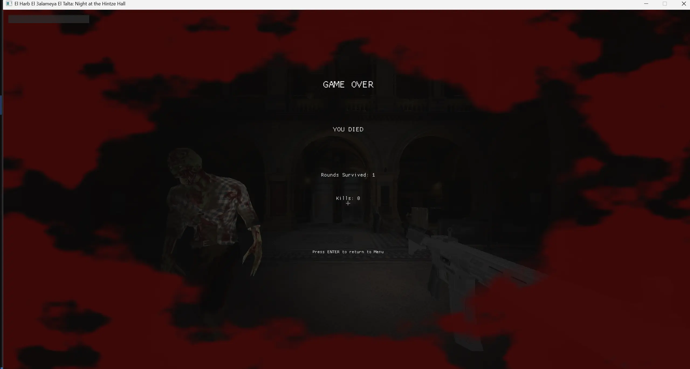

  

# Night at the GEM  
### Custom Real-Time 3D Graphics Engine & Interactive Experience

**Night at the GEM** is a real-time 3D interactive application powered by a **fully custom-built graphics engine** developed in C++ using modern OpenGL.  
The project combines physically constrained movement, skeletal animation, and a modular rendering architecture to deliver a performant and immersive large-scale indoor environment.

Rather than relying on off-the-shelf engines, all core systems — rendering, animation, physics, and scene management — are implemented from the ground up to provide full control over performance, extensibility, and visual fidelity.

---

## Overview

The application simulates a complex indoor environment rendered entirely in real time. Users can freely navigate the scene while interacting with animated entities governed by a custom physics and animation system.

The engine is architected around clearly defined subsystems, enabling stable runtime behavior, deterministic updates, and efficient asset handling. This design allows the project to scale beyond a visual demo into a structured real-time system.

---

## Engine Architecture

The project is built as a **custom graphics engine**, with explicit separation between low-level rendering and high-level gameplay logic.

### Core Engine Systems

- Rendering Engine  
- Scene & Entity System  
- Physics & Collision System  
- Skeletal Animation System  
- Input & Camera System  
- Audio System  
- Runtime & Timing Control  

Each system communicates through well-defined interfaces to maintain modularity and reduce coupling.

---

## Rendering Engine

- Modern OpenGL core profile (3.3+)  
- Fully custom shader pipeline (GLSL)  
- Multiple dynamic light sources  
- Physically inspired lighting and material models  
- Texture sampling and material abstraction  
- Efficient batching and draw-call management  
- Camera-space and world-space transformations  

---

## Physics System

The physics layer is designed to provide **stable, deterministic interaction** within the environment rather than arcade-style movement.

- Axis-aligned and oriented bounding volumes  
- Continuous collision detection  
- Collision resolution and response  
- Gravity and constrained motion  
- Environmental interaction constraints  
- Frame-rate–independent physics updates  

The physics system is decoupled from rendering and operates on a fixed timestep to ensure consistent simulation behavior.

---

## Skeletal Animation System

The engine includes a **custom skeletal animation pipeline** for animating characters and dynamic entities.

- Bone hierarchy and joint transforms  
- Skinning using vertex-bone weight mapping  
- Keyframe-based animation playback  
- Interpolated pose evaluation  
- CPU-driven animation evaluation with GPU skinning  
- Support for multiple animation clips  

This system enables fluid character movement while remaining tightly integrated with the engine’s physics and scene logic.

---

## Scene & Entity Management

- Hierarchical scene graph  
- Transform propagation  
- Entity lifecycle management  
- Spatial organization for efficient updates  
- Asset reference and reuse system  

---

## Controls

| Action | Input |
|------|------|
| Move | `W A S D` |
| Look Around | Mouse |
| Action / Jump | `Space` |
| Exit | `ESC` |

---

## Technology Stack

- **Language:** C++  
- **Graphics API:** OpenGL  
- **Windowing & Input:** GLFW  
- **Math:** GLM  
- **Model Import:** Assimp  
- **Textures:** stb_image  
- **Audio:** OpenAL / SDL  

---

## Project Structure

